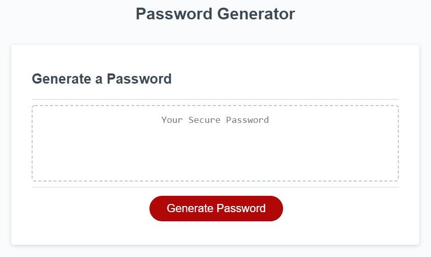

# SecurePasswordGenerator
JavaScript password generator
 
This website was created to generate strong passwords for employees who have access to sensitive data.
User's can set criteria for the password.
    For example: length, numeric, lowercase, uppercase, and/or special characters.

To visit the site click here:
 
https://achampigny4.github.io/SecurePasswordGenerator/
  

